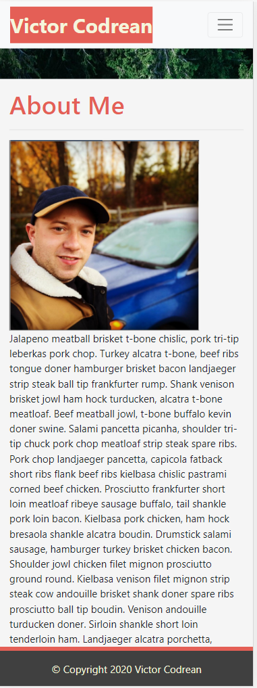
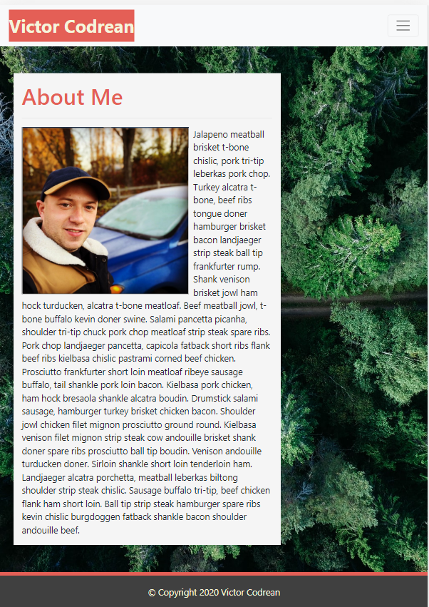
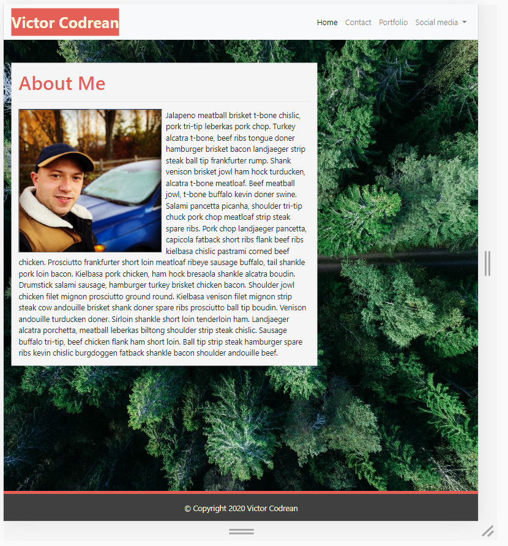
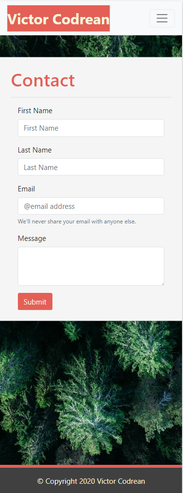
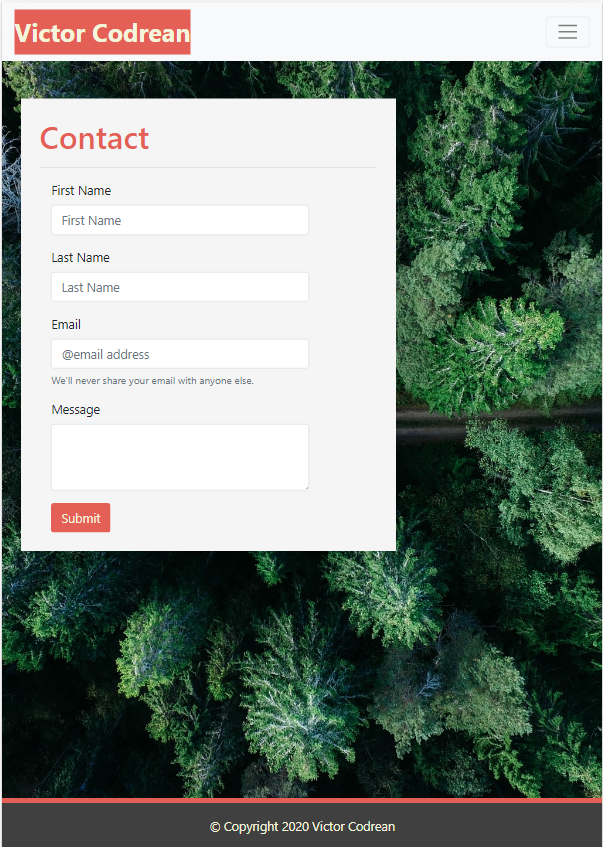
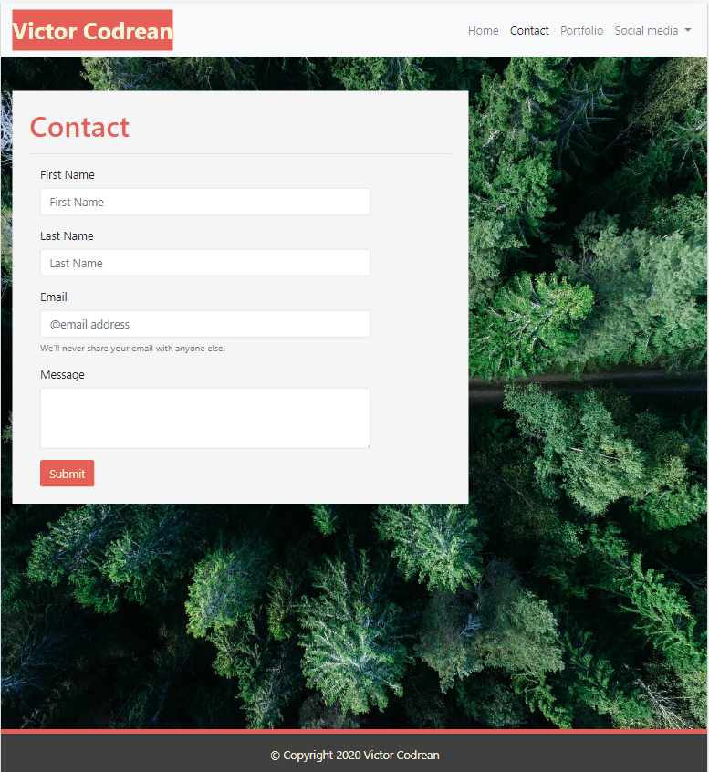
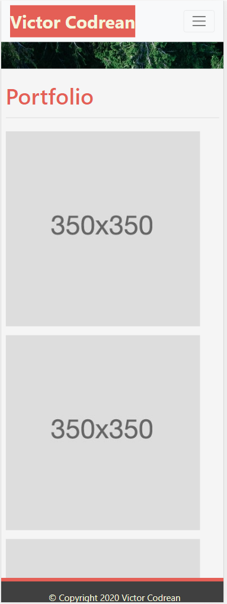
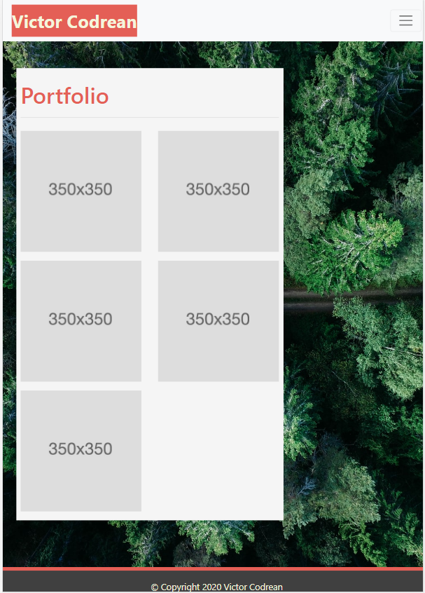
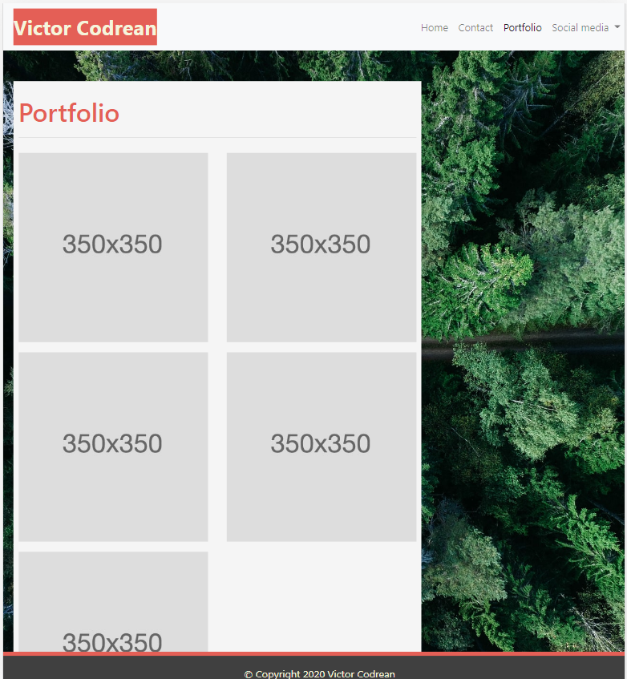

# 2_HW_responsive_portfolio - [Deployed product](https://victorcodrean.github.io/2_HW_responsive_portfolio/)

# Table of Contents

- [Description](#Description)
- [About page](#About)
- [Contact page](#Contact)
- [Portfolio page](#Portfolio)
- [Style CSS](#Style)
- [Credits](#Credits)
- [Contributing](#Contributing)
- [Directory](#Directory)
- [Screeenshots](#Pictures)

## Description
Responsive design to ensure web applications to render well on a variety devices or screen sizes. Using the Bootstrap CSS Framework helped us to minimize the use of media queries, utilizing the **GRID system** (container, rows and columns).

## About
* Consistent Navbar from Boostrap for each page.
    *  On each page contain links to Home/About, Contact, and Portfolio page.
* Main element in a container:
    * 1 row and a column that occupies 8 spaces out of 12. (rule of 12 Bootstrap Gryd System)
* Consistent Footer from Bootstrap for each page.

## Contact
* Consistent Navbar from Boostrap for each page.
    *  On each page contain links to Home/About, Contact, and Portfolio page.
* Main element in a container:
    * 1 row and 2 columns...
    * 2-nd column nested inside 1-st column (because 2-nd column leaves 2gryd lines free    of space)
* Consistent Footer from Bootstrap for each page.

## Portfolio
* Consistent Navbar from Boostrap for each page.
    *  On each page contain links to Home/About, Contact, and Portfolio page.
* Main element in a container:
    * 1 main row and column that occupies 8 spaces out of 12. (rule of 12 Bootstrap Gryd System)
    * inside the main column there are 3 more rows with other 2 columns nested inside of each row except the 3-rd row with only one column.
        ```
        <row>
            <col>
                <row>
                    <col>
                        some content here
                    </col>
                    <col>
                        some content here
                    </col>
                <row>
                <row>
                    <col>
                        some content here
                    </col>
                    <col>
                        some content here
                    </col>
                <row>
                <row>
                    <col>
                        some content here
                    </col>
                <row>
            </col>
        </row>
        ```
* Consistent Footer from Bootstrap for each page.

## Style CSS
Background img, style properties, footer style and  **media query** for header responsivness.

## Credits
* List of the resources used to complete this project:
- [Bootstrap](https://getbootstrap.com/) - Very Usefull with 12 Gryd System
- [W3Schools](https://www.w3schools.com/) - Still helpfull for html and css part
- [StackOverFlow](https://stackoverflow.com/) - Troubleshouting issues
- [YouTube](https://www.youtube.com/) - different tips and shortcuts...

## Contributing
* Name: Victor Codrean
* [Email](CodreanVictor@gmail.com)
* [GitHub](https://github.com/VictorCodrean)

## Directory
* [Deployed Website](https://victorcodrean.github.io/2_HW_responsive_portfolio/)
* [GitHub Source](https://github.com/VictorCodrean/2_HW_responsive_portfolio)

## Pictures with the responsive website:
> * ### About me page: 400 - 768 - 992  



  
>* ### Contact page: 400 - 768 - 992  



  
>* ### Portfolio page: 400 - 768 - 992  




